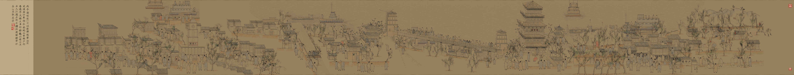
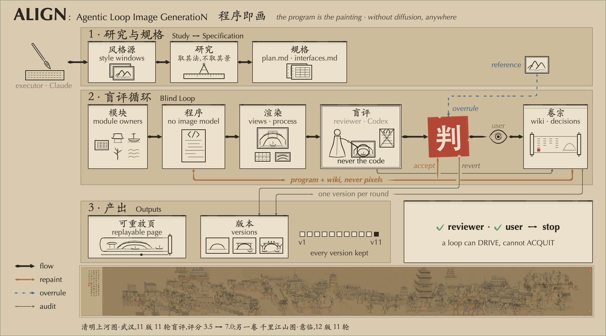
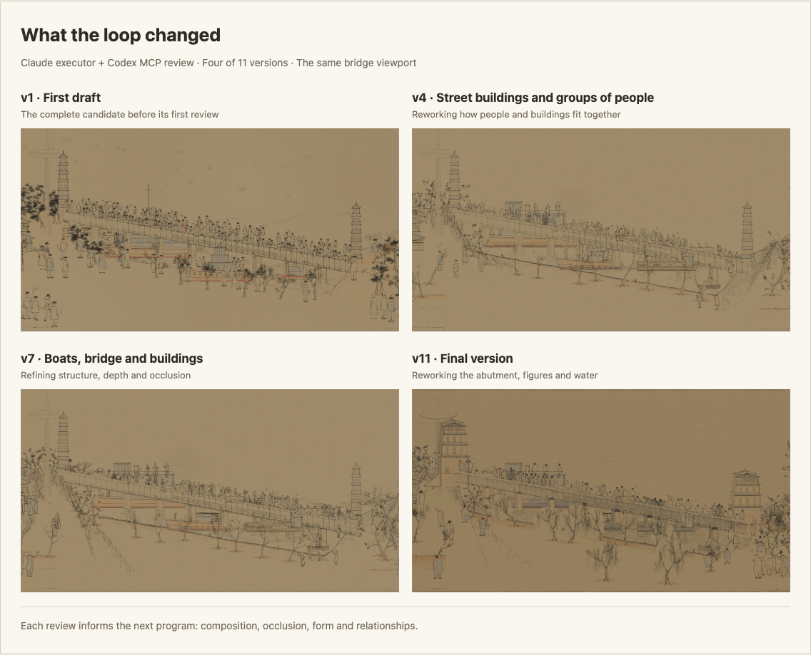
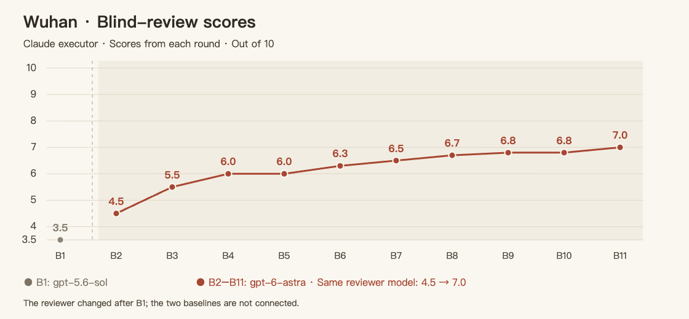
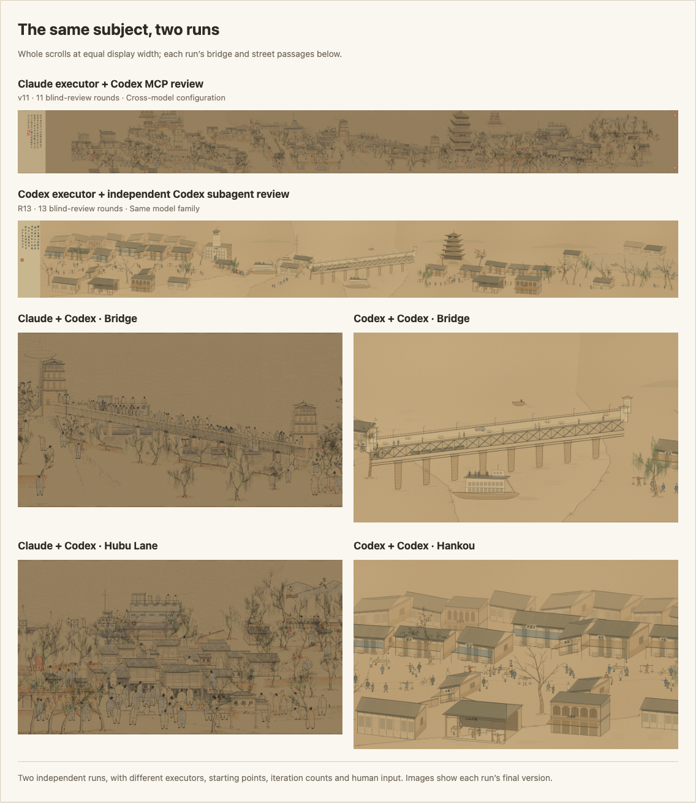

# ALIGN — Agentic Loop Image GeneratioN

> 🎨 **Let coding agents paint.** ALIGN explores image generation beyond diffusion and autoregressive image models: a powerful coding agent studies a reference, writes p5.js to draw the picture, and improves the program through independent visual review. Every stroke, layer and construction stage lives in source you can read, edit and replay.

English · [中文](README_CN.md) · [Interactive gallery](https://wanshuiyin.github.io/ALIGN-Agentic-Loop-Image-GeneratioN/)

[](https://wanshuiyin.github.io/ALIGN-Agentic-Loop-Image-GeneratioN/examples/qingming-wuhan/qingming-wuhan-preview.html#p=1)

*Qingming in Wuhan* · Claude executor + Codex MCP reviewer · 11 versions. [Explore the scroll and replay its construction →](https://wanshuiyin.github.io/ALIGN-Agentic-Loop-Image-GeneratioN/examples/qingming-wuhan/qingming-wuhan-preview.html#p=1)

[](https://wanshuiyin.github.io/ALIGN-Agentic-Loop-Image-GeneratioN/examples/align-figure/figure.html#p=1)

Figure 1 is itself a p5.js program: six construction stages and an [SVG export](docs/figure1.svg).

The loop is straightforward: study the reference, specify the work, draw and render, ask a fresh reviewer to look at the pixels, then change the program. A small wiki keeps the decisions and reasons across rounds. Feedback can be accepted, challenged against the reference, or reverted when the result gets worse. The skills follow [HERO](https://github.com/wanshuiyin/HERO-Anti-OverDefense/blob/main/RULES.md): useful work and concrete checks, without extra defensive machinery.

## What the loop changed

**Planning gets the picture started; visual feedback gives the next round something new to reason about.** Work such as [T2I-R1](https://arxiv.org/abs/2505.00703) shows benefits from reasoning in image generation. Our run also began with substantial planning: three composition proposals, a detailed specification and interfaces for eight modules. Even with a strong coding agent, the first complete render still had floating figures, repetitive buildings and weak spatial relationships.

ALIGN extends reasoning across a **visual feedback loop: render → review → revise**. Each rendered image gives the reviewer concrete evidence; its critique gives the executor a new problem to solve. The program and wiki carry those decisions into the next round. Additional effort goes into examining consequences and revising the drawing rules, as well as planning before the first render.



Some improvements required **changing how objects were constructed**. B3 identified that adding more poses would leave the same underlying figure template. In v4, people became action groups sharing contact points and weight; repeated facades became continuous streets with recessed shops, side walls and overlapping roofs. Changing a shared drawing rule can improve many passages at once. [The decision](examples/qingming-wuhan/wiki/decisions.md#d-10--b3-裁决四处换原语三处调参-2026-09-05) · [All 11 versions](https://wanshuiyin.github.io/ALIGN-Agentic-Loop-Image-GeneratioN/examples/qingming-wuhan/iterations/index.html).



B2–B11 used gpt-6-astra: 4.5 → 7.0, with two plateaus. Progress included reversals: v5's tree rewrite looked worse, so the next version restored the earlier construction and made a smaller correction. B1 used gpt-5.6-sol and is shown separately. The vertical axis starts at 3.5; scores are out of 10. [Original review log](examples/qingming-wuhan/wiki/review-log.md).

## The same subject, two runs



In these two runs, the Claude + Codex result has richer street scenes, more varied groups of people and more depth around the bridge and boats. The Codex + Codex result retains more repeated building blocks. Both used review loops: 11 rounds for the former, 13 for the latter. [Open the comparison →](https://wanshuiyin.github.io/ALIGN-Agentic-Loop-Image-GeneratioN/#comparison)

**Adversarial review gives the executor a concrete challenge.** The reviewer sees the rendered picture and reference, without access to the source code. Its job is to identify the most visible failures and check whether previous ones remain. In B1, it found that the left city dominated the composition, despite the plan calling for the bridge to be the focus. The executor then reduced the competing city crowds and reorganized the bridge events. The criticism changed the composition. [Decision D-07](examples/qingming-wuhan/wiki/decisions.md#d-07--桥必须是峰-2026-09-05).

Using another model family is intended to challenge assumptions the executor may keep repeating. Both configurations here use independent review; the comparison shows how different executor–reviewer pairings developed the same subject. Our reading of these runs is that useful critique and the executor's ability to act on it matter together: more rounds alone do not explain the stronger result.

## Use the skills

Two tasks, with a complete skill for each runtime:

| Task | Claude Code | Codex |
|---|---|---|
| Paint from a reference, or carry its craft into a new subject | [reference-art-loop](skills/reference-art-loop/SKILL.md) | [reference-art-loop-codex](skills_codex/reference-art-loop-codex/SKILL.md) |
| Draw a method figure with construction replay and SVG export | [method-figure-loop](skills/method-figure-loop/SKILL.md) | [method-figure-loop-codex](skills_codex/method-figure-loop-codex/SKILL.md) |

**Claude Code:** copy the desired folder from `skills/` into your project's `.claude/skills/` ([skill setup](https://code.claude.com/docs/en/skills)). Connect Codex MCP for independent visual review:

```sh
claude mcp add codex --scope user -- codex mcp-server
```

```text
/reference-art-loop Qingming Along the River → Wuhan → p5.js handscroll, rounds: 8
/method-figure-loop Reference Figure 1 → my method → p5.js, rounds: 5
```

**Codex:** open this repository; `.agents/skills/` exposes both ports. Each review round uses a new Codex subagent with a separate context. [Setup and usage](skills_codex/README.md).

```text
$reference-art-loop-codex Qingming Along the River → Wuhan → p5.js handscroll, rounds: 8
$method-figure-loop-codex Reference Figure 1 → my method → p5.js, rounds: 5
```

Supply a reference image, an output directory and the subject or method to draw. The agent needs image viewing, local browser rendering and the corresponding reviewer connection.

## Three worked examples

All three main examples were drawn in Claude Code and reviewed through Codex MCP.

| Example | What you can explore |
|---|---|
| [Qingming in Wuhan](examples/qingming-wuhan/) | 11 runnable versions, fixed-view evolution, process sheets and review decisions |
| [Figure 1](examples/align-figure/) | Final program, seven PNG/SVG versions, five blind-review replies and design decisions |
| [A Thousand Li of Rivers and Mountains](examples/qianli-process/) | Final program, ten painting stages, an evolution sheet and 11 blind-review records |

The review records also show the limits. Neither main painting passed its visual gate; the Codex Wuhan run did not pass either. Figure 1's last independent review was v5 at 7/10; v6 and v7 were self-reviewed. The two Wuhan runs differed in starting point, iteration count and human input, so the comparison describes these works. The planned tests of specifications versus direct coding, and external review versus self-review, have not been run.

[MIT](LICENSE) for original repository content. [Third-party sources and licenses](THIRD_PARTY_NOTICES.md).
