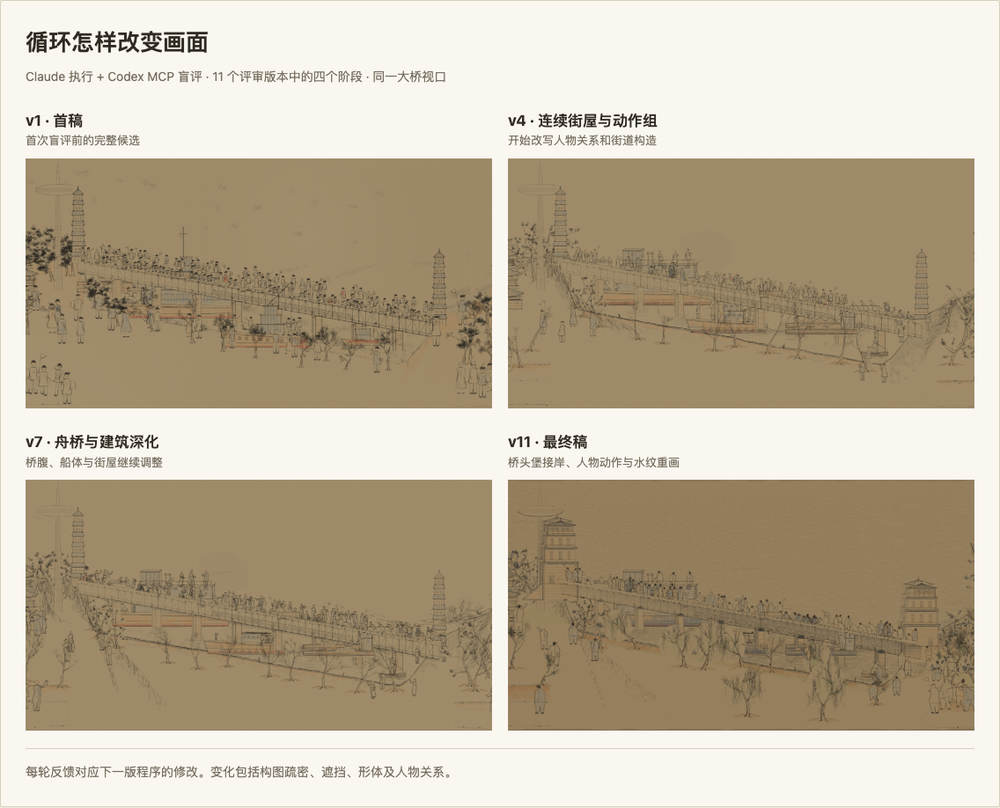
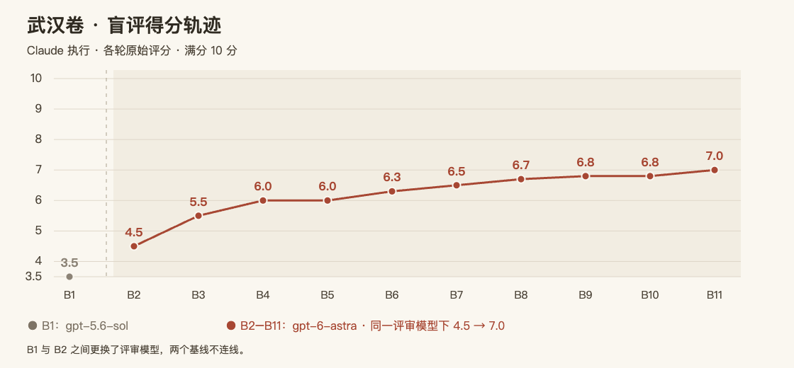
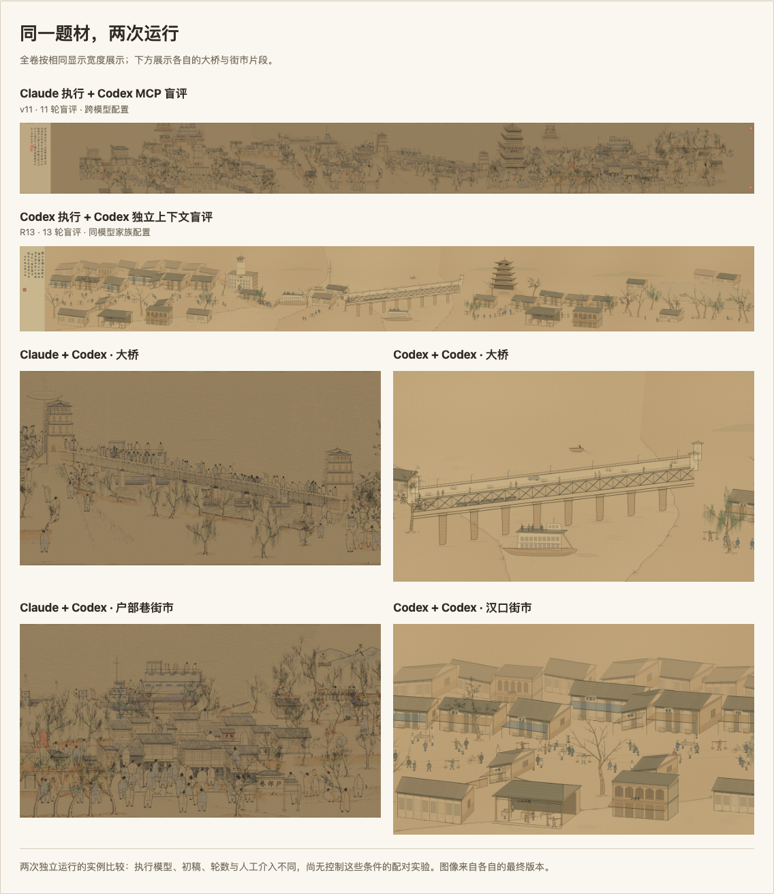

# ALIGN — Agentic Loop Image GeneratioN

> 🎨 **让 coding agent 直接作画。** 在 diffusion 和自回归图像模型之外，ALIGN 探索一条用代码生成图像的路线：依靠强大的编程能力，让 agent 研究参考、用 p5.js 落笔，再通过独立视觉审阅逐轮改进。每一笔、每一层、每一道工序都在源码里，可以读、可以改，也可以从空白开始回放。

[English](README.md) · 中文 · [交互展示](https://wanshuiyin.github.io/ALIGN-Agentic-Loop-Image-GeneratioN/)

[](https://wanshuiyin.github.io/ALIGN-Agentic-Loop-Image-GeneratioN/examples/qingming-wuhan/qingming-wuhan-preview.html#p=1)

《清明上河图·武汉》· Claude 执行 + Codex MCP 审阅 · 11 个版本。[展开长卷，回放十道工序 →](https://wanshuiyin.github.io/ALIGN-Agentic-Loop-Image-GeneratioN/examples/qingming-wuhan/qingming-wuhan-preview.html#p=1)

[](https://wanshuiyin.github.io/ALIGN-Agentic-Loop-Image-GeneratioN/examples/align-figure/figure.html#p=1)

Figure 1 也是一段 p5.js 程序，支持六阶段构建回放和 [SVG 导出](docs/figure1.svg)。

ALIGN 把这个过程接成循环：研究参考，写下规格，编程并渲染，交给新开的评审看图，再把反馈改进程序。一个小型 wiki 留下每轮的决定和理由；意见可以采纳，也可以拿参考图来反驳，改坏了就回退。技能遵循 [HERO](https://github.com/wanshuiyin/HERO-Anti-OverDefense/blob/main/RULES.md)：做有用的事，检查具体问题，避免过度防御。

## Loop 改变了什么

**先想清楚再画，画出来之后才有下一轮思考的新依据。** [T2I-R1](https://arxiv.org/abs/2505.00703) 等工作已经展示了推理对图像生成的帮助。武汉卷也做了充分的前期规划：三份构图方案、详细规格、八个模块的接口约定。即使用强大的 coding agent，首张完整渲染仍有悬空的人物、重复的建筑，以及没有成立的空间关系。

ALIGN 通过 **渲染 → 审阅 → 修改**，让思考延续到后续轮次。每次渲染提供新的视觉证据，评审把问题说具体，执行者据此重新推敲画法；程序和 wiki 则把这些决定带到下一轮。投入的计算既用于落笔前的规划，也用于观察实际结果、修正原先的判断。



有些进步来自**换一种构造对象的方法**。B3 指出，多加几种姿势仍会沿用同一套人物模板。到了 v4，人物改成共享接触点和负重关系的动作组，重复排列的立面改成有店面进退、侧墙和屋顶遮挡的连续街屋。改一条共享的绘图规则，就能同时影响画中的许多地方。[这次决定](examples/qingming-wuhan/wiki/decisions.md#d-10--b3-裁决四处换原语三处调参-2026-09-05) · [全部 11 版回放](https://wanshuiyin.github.io/ALIGN-Agentic-Loop-Image-GeneratioN/examples/qingming-wuhan/iterations/index.html)。



B2–B11 使用同一评审模型 gpt-6-astra，得分从 4.5 升至 7.0，中途两次持平，也有改坏后回退的过程：v5 重写的树被判退步，下一版恢复了原来的构造，再做较小的修正。B1 用的是 gpt-5.6-sol，单列显示。纵轴从 3.5 开始，满分仍是 10 分。[原始评审记录](examples/qingming-wuhan/wiki/review-log.md)。

## 同一题材，两次运行



这两次运行里，Claude + Codex 的街市更连贯，人物群组和舟桥层次也更丰富；Codex + Codex 版还留着较多整齐重复的建筑体块。两边都有评审循环，分别跑了 11 轮和 13 轮。[打开大图对比 →](https://wanshuiyin.github.io/ALIGN-Agentic-Loop-Image-GeneratioN/#comparison)

**对抗式审阅的作用，是给执行者提出具体的挑战。** 评审只看成图和参考，看不到源码，判断以画面里实际成立的关系为准。它要指出最显眼的问题，并检查上一轮的问题还在不在。B1 就发现，实际抢眼的是左侧街市，而规划要求大桥成为重心。执行者随后压低了街市人群密度，重新组织桥面的事件。批评由此改变了构图。[决策 D-07](examples/qingming-wuhan/wiki/decisions.md#d-07--桥必须是峰-2026-09-05)。

引入另一模型家族，是为了挑战执行者可能反复沿用的判断。这里两种配置都有独立审阅，对比展示的是不同执行者与评审组合如何完成同一题材。从这两次运行看，我们更关注反馈是否有用、执行者能否把它落实成有效的画法；单看轮数多少，解释不了成图的差距。

## 使用 skills

两种任务，各有完整的 Claude Code 和 Codex 版本：

| 用途 | Claude Code | Codex |
|---|---|---|
| 参考画意临，或把画法迁移到新题材 | [reference-art-loop](skills/reference-art-loop/SKILL.md) | [reference-art-loop-codex](skills_codex/reference-art-loop-codex/SKILL.md) |
| 方法图、构建回放与 SVG 导出 | [method-figure-loop](skills/method-figure-loop/SKILL.md) | [method-figure-loop-codex](skills_codex/method-figure-loop-codex/SKILL.md) |

**Claude Code：**把需要的 `skills/` 子目录复制到项目的 `.claude/skills/`（[安装说明](https://code.claude.com/docs/en/skills)），再接入 Codex MCP 做独立视觉审阅：

```sh
claude mcp add codex --scope user -- codex mcp-server
```

```text
/reference-art-loop 清明上河图 → 武汉 → p5.js 手卷，rounds: 8
/method-figure-loop 给定 Figure 1 → 我的方法 → p5.js，rounds: 5
```

**Codex：**在本仓库打开 Codex，`.agents/skills/` 已接好两个入口。每轮由新的 Codex 子代理在独立上下文中审图。[详细用法](skills_codex/README.md)。

```text
$reference-art-loop-codex 清明上河图 → 武汉 → p5.js 手卷，rounds: 8
$method-figure-loop-codex 给定 Figure 1 → 我的方法 → p5.js，rounds: 5
```

同时提供参考图、输出目录，以及要画的题材或方法内容。运行环境需要看图、本地浏览器渲染和相应的评审连接。

## 三个完整案例

三条主线均由 Claude Code 执行、Codex MCP 审阅。

| 案例 | 可以看什么 |
|---|---|
| [清明上河图·武汉](examples/qingming-wuhan/) | 11 版可回放程序、固定视口演进、工序图和评审决策 |
| [Figure 1](examples/align-figure/) | 最终程序、七版 PNG/SVG、五轮盲评原文和设计决定 |
| [千里江山图](examples/qianli-process/) | 最终程序、十道绘画工序、演进图和 11 轮盲评记录 |

记录也保留了没有做好的地方。两卷主线作品都没有通过视觉门，Codex 武汉版也没有通过。Figure 1 最后一次独立评审是 v5 的 7/10，v6、v7 是自看。两次武汉运行的初稿、轮数和人工介入不同，对比说的是这两幅作品；“规格与直接写代码”“外部评审与自审”这两个对照实验尚未运行。

仓库原创内容采用 [MIT 许可](LICENSE)。[第三方素材来源与许可](THIRD_PARTY_NOTICES.md)。
